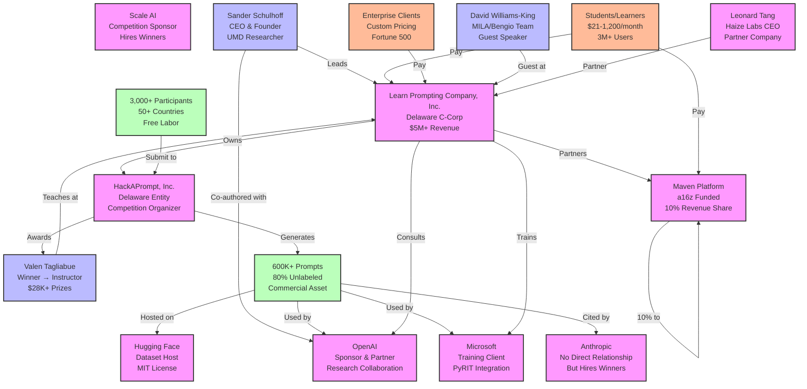

# HackAPrompt Ecosystem Relationship Map

## Key Relationship Insights

### 1. Circular Value Flow
- **Participants** → Create Data → **HackAPrompt** → Sells to **AI Companies**
- **Winners** → Become **Instructors** → Train New **Participants**
- **Students** → Pay for **Training** → Learn to **Attack** → Create More **Data**

### 2. Revenue Concentration
- **Learn Prompting** controls all major revenue streams
- **Maven** takes 10% but provides platform infrastructure
- **Enterprise clients** pay for solutions to problems taught by same organization

### 3. Strategic Partnerships
- **OpenAI**: Deep integration (research, training, data)
- **Microsoft**: Major client and technology partner
- **Anthropic**: Notably absent despite hiring winners
- **Academic**: MILA/Bengio connection provides credibility

### 4. Data Ownership Chain
- **Participants** create prompts (no compensation)
- **HackAPrompt** claims ownership via competition rules
- **Dataset** becomes commercial asset on Hugging Face
- **Companies** use data to improve models
- **Learn Prompting** profits from entire chain

### 5. Talent Pipeline
- **Competition** identifies top talent
- **Winners** get visibility and prizes
- **Companies** hire directly from winner pool
- **Learn Prompting** converts winners to instructors
- **Ecosystem** self-perpetuates

## Critical Observations

1. **Single Point of Control**: Sander Schulhoff controls entire ecosystem
2. **No Anthopic Equity**: Despite claims, no financial relationship found
3. **Bootstrap Success**: No external funding needed due to multiple revenue streams
4. **Conflict Multiplier**: Teaching attacks while selling defenses maximizes profit
5. **Community Exploitation**: 3,000+ contributors receive no revenue share

---

*This diagram represents publicly observable relationships as of July 9, 2025. Actual ownership structures and financial arrangements may differ from public representations.*