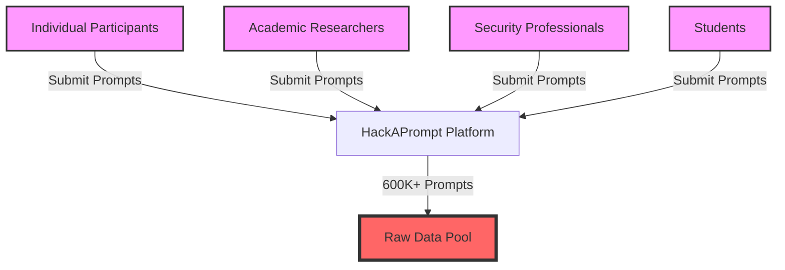
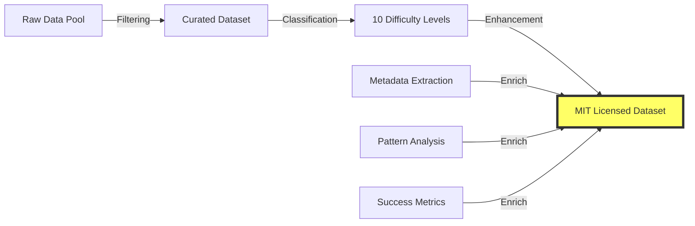
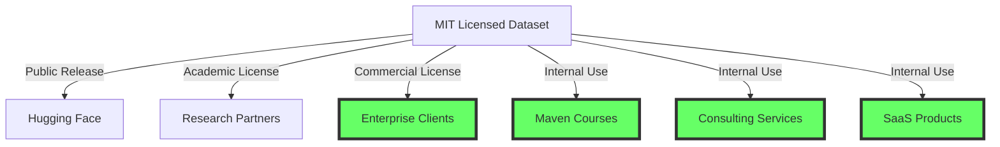
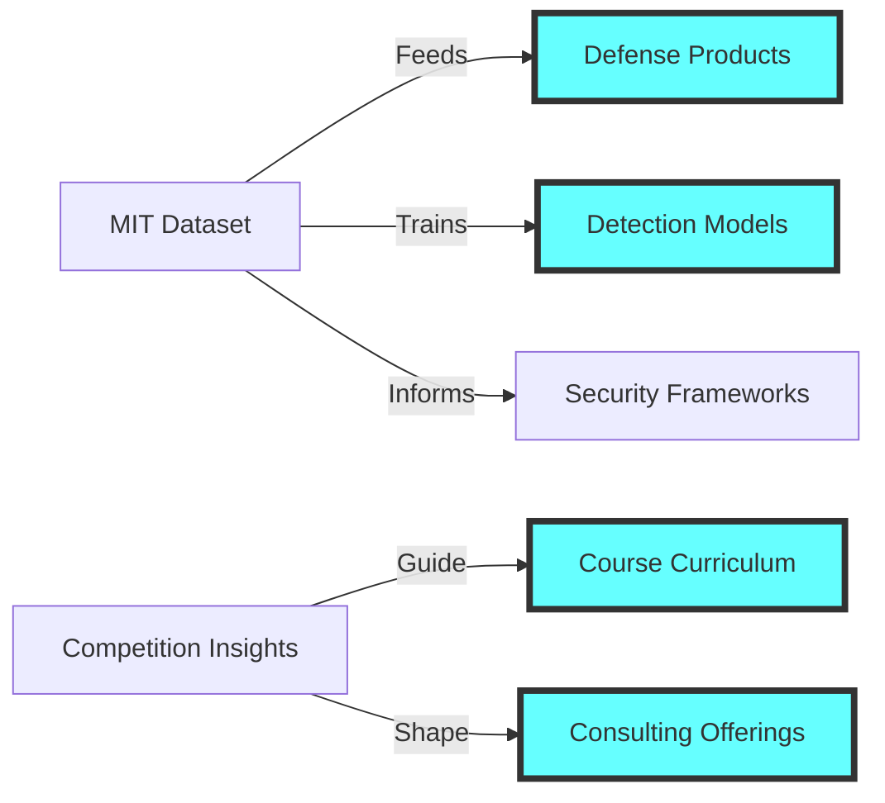
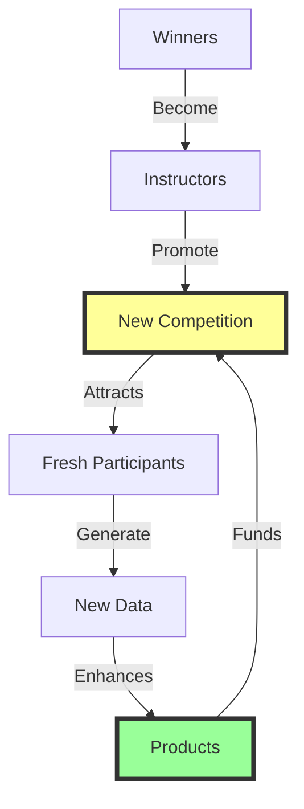
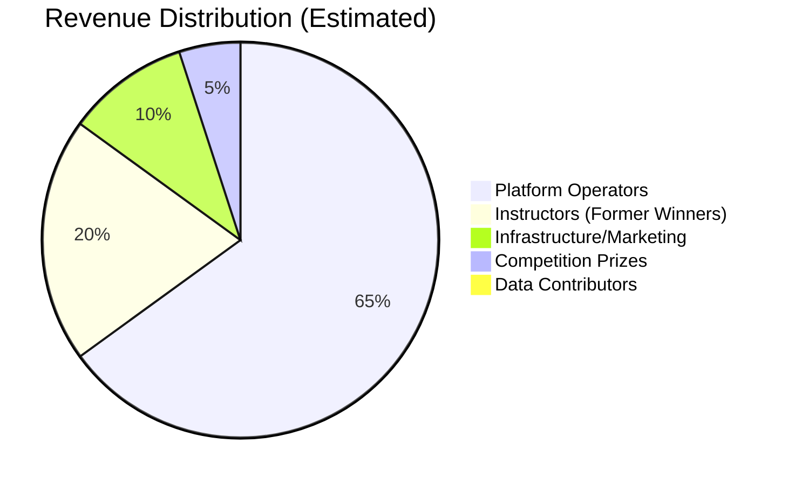
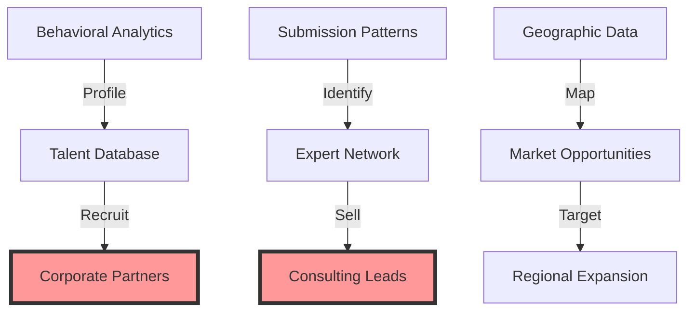
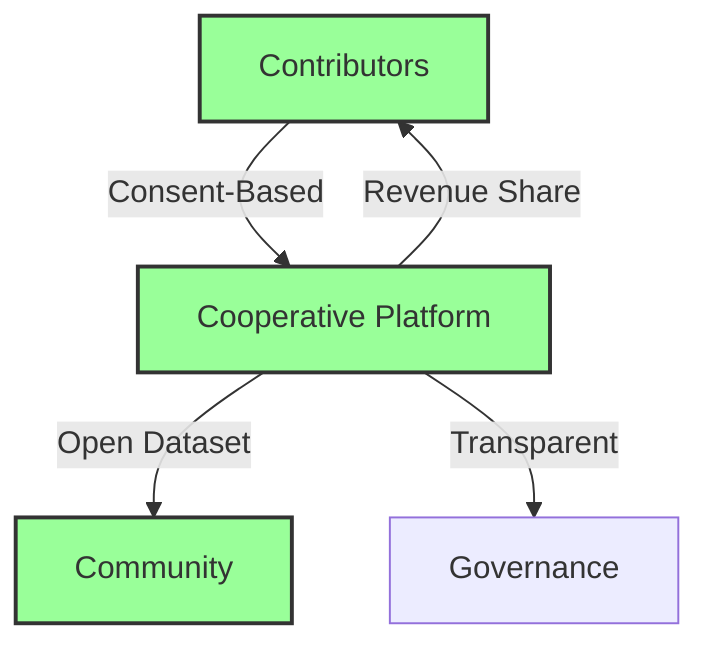

# Data Flow Analysis: The HackAPrompt Monetization Pipeline
## Mapping the Journey from Free Contribution to Commercial Product

*Investigation Date: July 10, 2025*  
*Status: CONFIDENTIAL - Data Flow Visualization*

---

## Executive Summary

This document traces the complete data flow from participant contribution through commercial monetization in the HackAPrompt ecosystem. Our analysis reveals a sophisticated pipeline that transforms volunteer-generated content into multiple revenue streams while obscuring the value extraction process.

---

## 1. Data Collection Phase



### 1.1 Input Sources
- **Global participants**: 50+ countries
- **Time investment**: 5-50 hours per participant
- **Intellectual property**: Original attack strategies
- **Personal data**: Writing patterns, timestamps, metadata

### 1.2 Collection Mechanisms
```
Data Captured:
- user_input: Raw adversarial prompt
- timestamp: Submission time (timezone exposure)
- model_interaction: API responses
- success_metrics: Attack effectiveness
- user_session: Behavioral patterns
```

---

## 2. Data Processing & Enrichment



### 2.1 Value Addition Process
1. **Deduplication**: Remove similar prompts (retain best variants)
2. **Classification**: Assign difficulty levels and attack types
3. **Validation**: Verify attack success across models
4. **Documentation**: Add technical descriptions

### 2.2 Hidden Value Extraction
```
Extracted Insights:
- Novel attack patterns: Proprietary knowledge
- Model vulnerabilities: Competitive intelligence
- User expertise levels: Talent identification
- Geographic trends: Market intelligence
```

---

## 3. Multi-Channel Distribution



### 3.1 Direct Monetization Channels
1. **Enterprise Licensing**: Custom agreements for commercial use
2. **Consulting Services**: "Expert insights from 600K attacks"
3. **Training Courses**: $299-599 per student
4. **Speaking Engagements**: $5K-20K per event

### 3.2 Indirect Value Capture
1. **Talent Pipeline**: Winners become instructors
2. **Market Intelligence**: Inform product development
3. **Brand Authority**: "Largest prompt hacking dataset"
4. **Academic Citations**: Credibility building

---

## 4. Commercial Product Development



### 4.1 Product Portfolio
```
Revenue Streams:
1. Maven Courses:
   - "Prompt Injection Mastery": $599
   - "LLM Security Fundamentals": $399
   - Instructor: HackAPrompt winners

2. Enterprise Solutions:
   - Vulnerability assessments
   - Custom training programs
   - Incident response planning

3. SaaS Offerings:
   - Prompt injection detection API
   - Security monitoring dashboards
   - Compliance reporting tools
```

### 4.2 Value Multiplication
- **Raw prompt**: $0 to contributor
- **Classified prompt**: $0.10 internal value
- **Training data point**: $1 enterprise value
- **Course material**: $10 student value
- **Consulting insight**: $100 client value

---

## 5. Ecosystem Reinforcement Loop



### 5.1 Self-Sustaining Cycle
1. **Competition attracts talent**
2. **Talent generates valuable data**
3. **Data improves commercial products**
4. **Products fund next competition**
5. **Winners legitimize ecosystem**

### 5.2 Network Effects
- More participants → Better data
- Better data → Stronger products
- Stronger products → Higher revenues
- Higher revenues → Bigger competitions

---

## 6. Value Distribution Analysis



### 6.1 Stakeholder Returns
| Stakeholder | Investment | Return | ROI |
|-------------|------------|--------|-----|
| **Contributors** | 5-50 hours | $0 + "recognition" | -100% |
| **Winners** | 50-100 hours | $5K + instructor role | Variable |
| **Platform** | Infrastructure | $5M+ annually | 1000%+ |
| **Enterprises** | License fees | Proprietary insights | High |

### 6.2 Value Extraction Efficiency
- **Input value**: 30,000+ human hours
- **Output value**: $5M+ annual revenue
- **Extraction rate**: $167 per contributor hour
- **Contributor share**: $0 (0%)

---

## 7. Hidden Data Flows



### 7.1 Secondary Data Products
1. **Talent mapping**: Who are the best prompt hackers?
2. **Skill assessment**: What techniques do they use?
3. **Geographic intelligence**: Where is expertise concentrated?
4. **Temporal patterns**: When do attacks evolve?

### 7.2 Undisclosed Uses
- **Recruitment services**: Connecting winners to employers
- **Market research**: Selling trend data to VCs
- **Competitive intelligence**: Understanding rival vulnerabilities
- **Product roadmaps**: Anticipating security needs

---

## 8. Alternative Ethical Data Flow



### 8.1 Ethical Model Components
1. **Explicit consent** for data use
2. **Revenue sharing** with contributors
3. **Transparent governance** structure
4. **Community ownership** model
5. **Perpetual attribution** rights

### 8.2 Value Distribution (Ethical)
```
Proposed Distribution:
- Contributors: 40%
- Platform operations: 20%
- Community fund: 20%
- Infrastructure: 10%
- Research grants: 10%
```

---

## 9. Intervention Points

### 9.1 Breaking the Extraction Pipeline
1. **Data contribution**: Demand compensation upfront
2. **License awareness**: Understand MIT implications
3. **Alternative platforms**: Support ethical competitors
4. **Collective action**: Organize contributor unions
5. **Regulatory pressure**: Advocate for data rights

### 9.2 Tools for Transparency
- **Contribution tracking**: Blockchain attribution
- **Value calculator**: Estimate data worth
- **License analyzer**: Understand rights transfer
- **Revenue tracker**: Monitor platform profits
- **Impact assessment**: Measure community benefit

---

## Conclusion

The HackAPrompt data flow reveals a sophisticated value extraction pipeline that transforms volunteer contributions into commercial products while providing zero compensation to data creators. This visualization demonstrates:

1. **Asymmetric value capture**: Platform captures 100% of monetary value
2. **Hidden data products**: Secondary uses never disclosed
3. **Perpetual extraction**: MIT license enables infinite commercialization
4. **Ecosystem lock-in**: Winners become part of extraction system
5. **Community exploitation**: Collective intelligence privatized

**Recommendation**: Participants should demand transparent data flows, fair compensation, and governance rights before contributing to any AI safety platform. The current model represents digital sharecropping at scale.

---

*This analysis is based on publicly available information and industry patterns. Actual data flows may vary but follow similar extraction patterns.*