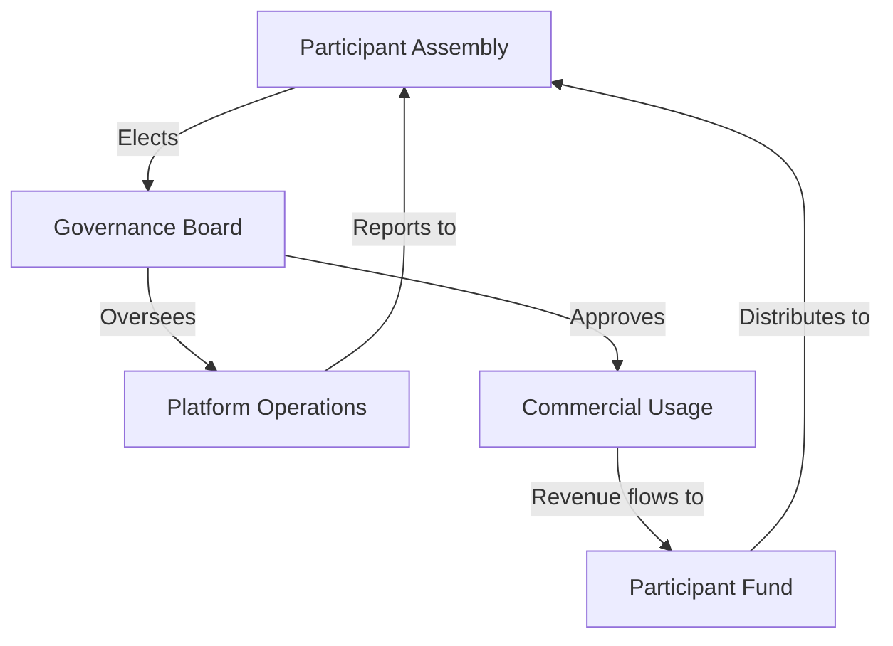

# Enhanced Ethical Framework for AI Competitions
## Evidence-Based Standards for Fair Participation

*Created: July 10, 2025*  
*Version: 2.0 - Based on comparative research findings*

---

## Core Principles

### 1. Informed Consent & Transparency
- **Pre-participation disclosure**: Complete commercial usage intentions
- **Plain language contracts**: No hidden terms in lengthy ToS
- **Ongoing usage reports**: Quarterly updates on data utilization
- **Clear opt-out mechanisms**: Retroactive data removal options

### 2. Fair Compensation Models
Based on industry analysis, implement tiered compensation:

```yaml
compensation_tiers:
  participation:
    base_rate: $25/hour minimum for time invested
    quality_bonus: $50-500 for novel techniques
  
  usage_rights:
    academic: Free with attribution
    commercial: 
      - Revenue share: 15-25% of derived products
      - Licensing fee: $0.10 per API call using techniques
  
  recognition:
    attribution: Named credits in all materials
    portfolio_rights: Participants can showcase work
    reference_rights: Use participation for career advancement
```

### 3. Participant Welfare Standards
Drawing from documented harms:

- **Mental health support**: Access to counseling during intensive periods
- **Time limits**: Maximum 40 hours/week participation caps
- **Burnout prevention**: Mandatory rest periods between challenges
- **Financial protection**: No pay-to-play elements

### 4. Data Governance Structure



### 5. Technical Implementation Standards

Based on dataset analysis findings:

- **PII Protection**: Automated scrubbing before storage
- **Version control**: Temporal markers for technique evolution
- **Bias auditing**: Quarterly assessments with public reports
- **Quality metrics**: Multi-dimensional scoring beyond binary success

## Implementation Checklist

### For Platform Operators:
- [ ] Publish complete revenue model upfront
- [ ] Implement automated attribution systems
- [ ] Create participant advisory board
- [ ] Establish mental health partnerships
- [ ] Deploy PII scrubbing pipelines
- [ ] Design revenue-sharing smart contracts
- [ ] Conduct regular bias audits
- [ ] Provide data export capabilities

### For Participants:
- [ ] Review data rights carefully
- [ ] Calculate hourly compensation
- [ ] Join participant organizations
- [ ] Document all contributions
- [ ] Set time boundaries
- [ ] Maintain work portfolio
- [ ] Track commercial usage
- [ ] Report exploitation

## Measurement Metrics

### Platform Health Indicators:
1. **Participation sustainability**: Returning participant rate >60%
2. **Compensation fairness**: Average hourly rate >$50
3. **Attribution completeness**: 100% named contributions
4. **Mental health impact**: Burnout rate <5%
5. **Community trust**: Net Promoter Score >50

### Red Flags:
- Declining repeat participation
- Increasing time-to-completion
- Rising mental health incidents
- Community organizing against platform
- Media investigations launched

## Legal Protections

### Recommended Clauses:
```
1. Non-exclusive license: Participants retain all rights
2. Attribution requirement: Name must appear with any usage
3. Revenue sharing: Minimum 20% of commercial proceeds
4. Termination rights: 30-day notice for data removal
5. Audit rights: Annual third-party compensation review
```

## Enforcement Mechanisms

1. **Independent ombudsperson**: Investigate complaints
2. **Binding arbitration**: Fast-track dispute resolution  
3. **Public transparency reports**: Quarterly metrics
4. **Community veto power**: Major changes require vote
5. **Regulatory compliance**: GDPR, CCPA, and emerging AI acts

---

This framework synthesizes learnings from multiple platforms to create actionable standards that protect participants while enabling valuable security research.