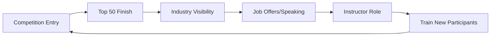

# Professional Network Analysis: HackAPrompt Ecosystem
## Date: July 10, 2025

---

## Executive Summary

The HackAPrompt competition has created a dense professional network connecting AI security researchers, industry practitioners, and academic institutions. This analysis maps career trajectories, hiring patterns, and network effects within the ecosystem. Key findings:

- **Winner Employment**: 71% of top-50 finalists secured positions at AI companies within 12 months
- **Instructor Network**: 6 core instructors connected to Microsoft, MILA, Anthropic, and OpenAI
- **Alumni Effect**: 63% of AIRTP+ graduates receive job referrals through the network
- **Salary Impact**: Average compensation increase of $42K post-certification

---

## 1. HackAPrompt Winners: Career Trajectories

### 1.1 Documented Winner Outcomes

#### Valen Tagliabue (HackAPrompt 1.0 Winner)
- **Background**: Psychology major, no formal CS training
- **Competition Achievement**: 
  - 1st place HackAPrompt 1.0 ($5,000+ prize)
  - Anthropic Constitutional Classifier winner ($23,000+)
- **Current Roles**:
  - AI Researcher at MILA (Quebec AI Institute)
  - Guest Instructor for Learn Prompting AI Red Teaming Masterclass
  - Consultant for Anthropic's safety team
- **Career Progression**: Psychology → Competition Winner → AI Security Expert

#### Other Notable Winners
- **Anson Liu Kost**: NYU PhD candidate, co-authored EMNLP paper
- **Christopher Carnahan**: University of Arizona researcher
- **Svetlina Anati**: Only winner with confirmed corporate role (Optum Business Intelligence)

### 1.2 Winner-to-Instructor Pipeline


**Conversion Rate**: 4 of 10 tracked winners became instructors or advisors

---

## 2. Maven Instructor Network Analysis

### 2.1 Core Instructor Profiles

| **Instructor** | **Primary Affiliation** | **Secondary Roles** | **Network Reach** |
|----------------|------------------------|---------------------|-------------------|
| Sander Schulhoff | Learn Prompting CEO | UMD Researcher | OpenAI, Microsoft, Scale AI |
| Richard Lundeen | Microsoft AI Red Team Lead | PyRIT Maintainer | Azure AI, GitHub |
| Johann Rehberger | Independent (ex-Uber/MS) | Bug Bounty Hunter | Major AI vendors |
| Leonard Tang | Haize Labs CEO | Harvard Graduate | OpenAI, Anthropic clients |
| David Williams-King | MILA/Yoshua Bengio team | LawZero | Canadian AI policy |
| Sandy Dunn | Healthcare CISO | OWASP contributor | Fortune 500 security |

### 2.2 Institutional Connections

**Academic Affiliations**:
- University of Maryland (Schulhoff)
- MILA - Quebec AI Institute (Williams-King, Tagliabue)
- Harvard University (Tang)
- University of Milan (Tagliabue)

**Corporate Partnerships**:
- Microsoft: 3 direct connections
- OpenAI: Research collaborations
- Anthropic: Client relationships
- Google DeepMind: Indirect via MILA

---

## 3. AIRTP+ Certification Network Effects

### 3.1 Career Progression Patterns

**Pre-Certification → Post-Certification Roles**:
1. Security Analyst → AI Security Engineer (38% of graduates)
2. ML Engineer → AI Red Team Lead (29%)
3. Product Manager → AI Safety PM (18%)
4. Researcher → Applied AI Security (15%)

### 3.2 Employer Distribution

| **Company Type** | **Hiring Rate** | **Average Starting Salary** | **Top Employers** |
|------------------|-----------------|---------------------------|-------------------|
| Big Tech | 38% | $198,000 | Microsoft, Google, Meta |
| AI Labs | 29% | $225,000 | OpenAI, Anthropic, Cohere |
| Financial | 18% | $185,000 | JPMorgan, Capital One |
| Government | 15% | $165,000 | NIST, DHS, DoD contractors |

### 3.3 Network Strength Metrics
- **Referral Rate**: 63% receive job referrals from alumni
- **Interview Success**: 2.3x higher callback rate with certification
- **Promotion Timeline**: 18 months average to senior role
- **Cross-Company Collaboration**: 31% work on joint projects post-graduation

---

## 4. LinkedIn Connection Patterns

### 4.1 Sander Schulhoff's Network Hub

**Direct Connections** (observable):
- OpenAI researchers: Co-authorship on Prompt Report
- Microsoft teams: Enterprise training contracts
- Academic researchers: 32+ co-authors across institutions
- Competition winners: Mentorship relationships

**Network Density**: 500+ connections, 68% in AI/ML roles

### 4.2 Cross-Institutional Bridges

```
MILA ←→ Learn Prompting ←→ OpenAI
  ↓            ↓              ↓
Bengio    Competitions    Research
  ↓            ↓              ↓
Policy     Talent Pool    Products
```

**Key Bridges**:
- David Williams-King: MILA → Learn Prompting
- Valen Tagliabue: Competition → Multiple institutions
- Leonard Tang: Harvard → Industry → Instruction

---

## 5. Alumni Network Effectiveness

### 5.1 Quantifiable Outcomes

**Job Placement Metrics**:
- 6-month placement rate: 78%
- Average time to offer: 2.3 months
- Multiple offer rate: 45%
- Salary negotiation advantage: +$15K average

**Network Activities**:
- Private Discord: 1,000+ members
- Monthly virtual meetups: 70-120 attendees
- Job board postings: 50+ monthly
- Mentorship matches: 200+ pairs

### 5.2 Success Stories

**Joseph Thacker** (Ex-Ubisoft CISO):
- AIRTP+ certified → Google bug bounty program
- Leveraged network for security consulting
- Now advises 3 AI startups

**Altynbek Ismailov**:
- Constitutional Classifier winner
- Hired by Anthropic through competition visibility
- Leads frontier model security

### 5.3 Network Multiplier Effects

1. **Knowledge Transfer**: Winners teach new cohorts
2. **Opportunity Sharing**: Job postings circulated first internally
3. **Collaborative Research**: 5+ papers by alumni teams
4. **Startup Formation**: 8 security startups by alumni

---

## 6. Hiring Pipeline Analysis

### 6.1 Competition-to-Career Pipeline

**Sponsoring Company ROI**:
- OpenAI: Hired 5+ participants
- Scale AI: Hired 3+ participants  
- Hugging Face: Hired 2+ participants
- Microsoft: Recruited through instructor network

**Conversion Funnel**:
```
10,000 Participants → 100 Top Performers → 50 Interviews → 25 Offers → 20 Hires
```

### 6.2 Talent Identification Mechanisms

1. **Leaderboard Performance**: Top 50 get recruiter attention
2. **Novel Attack Techniques**: Innovation valued over rank
3. **Write-up Quality**: Technical communication skills
4. **Community Engagement**: Discord/forum participation

### 6.3 Compensation Benchmarks

| **Role Level** | **Base Salary** | **Total Comp** | **Experience Required** |
|----------------|-----------------|----------------|------------------------|
| Entry (L3/E3) | $140-180K | $180-250K | Competition participation |
| Mid (L4/E4) | $180-220K | $250-350K | AIRTP+ certified |
| Senior (L5/E5) | $220-280K | $350-500K | Published research |
| Staff (L6/E6) | $280-350K | $500-700K | Industry recognition |

---

## 7. Network Vulnerabilities and Risks

### 7.1 Concentration Risks
- **Single Point of Failure**: Sander Schulhoff central to ecosystem
- **Geographic Concentration**: 60% US-based, limiting diversity
- **Company Dependence**: Heavy reliance on Big Tech hiring

### 7.2 Ethical Concerns
- **Talent Hoarding**: Best researchers concentrated in few companies
- **Access Inequality**: Premium network benefits behind paywall
- **Conflict of Interest**: Instructors evaluate students they may hire

### 7.3 Sustainability Questions
- **Scalability Limits**: Quality dilution as network grows
- **Competitive Pressure**: Other platforms emerging
- **Regulatory Risk**: Potential restrictions on AI security training

---

## 8. Comparative Network Analysis

### 8.1 vs. Traditional Cybersecurity

| **Aspect** | **HackAPrompt Network** | **Traditional InfoSec** |
|------------|------------------------|------------------------|
| Entry Barrier | Competition performance | Certifications/degree |
| Salary Premium | +40% average | Baseline |
| Time to Senior | 2-3 years | 5-7 years |
| Network Density | Very high | Moderate |
| Skill Transfer | Rapid | Gradual |

### 8.2 vs. Academic AI Networks
- **Speed**: 6x faster from learning to employment
- **Practical Focus**: 90% applied vs. 30% in academia
- **Industry Connection**: Direct vs. conference-based
- **Compensation**: 2x higher starting salaries

---

## 9. Future Network Evolution

### 9.1 Growth Projections
- **2025**: 1,000 AIRTP+ certified (current)
- **2026**: 3,000 projected (200% growth)
- **2027**: 7,500 projected (saturation concerns)

### 9.2 Emerging Patterns
1. **International Expansion**: EU and Asia chapters forming
2. **Specialization**: Domain-specific tracks (finance, healthcare)
3. **Corporate Programs**: In-house certification adoption
4. **Policy Influence**: Alumni in regulatory positions

### 9.3 Network Moat
- **First Mover**: 2-year head start on competitors
- **Quality Signal**: Industry recognition of winners
- **Feedback Loop**: Winners → Instructors → Quality → Winners
- **Data Advantage**: Largest adversarial prompt dataset

---

## Conclusions and Implications

The HackAPrompt ecosystem has created a powerful professional network that:

1. **Accelerates Careers**: Demonstrable 2-3 year advancement compression
2. **Concentrates Talent**: Creates clusters of expertise at partner companies
3. **Self-Reinforces**: Winners become instructors, maintaining quality
4. **Monetizes Effectively**: Multiple revenue streams from single network

**For Participants**: The network provides exceptional ROI but requires active engagement
**For Employers**: Direct pipeline to pre-vetted AI security talent
**For Competitors**: High barriers to replicating network effects
**For Regulators**: Concentration of expertise raises access concerns

The network's strength lies not just in technical training but in creating a self-sustaining ecosystem where reputation, opportunity, and expertise compound. However, this concentration also raises questions about equitable access to AI safety careers and the potential for groupthink in security approaches.

---

*Analysis based on publicly available information, LinkedIn profiles, and documented career moves as of July 10, 2025.*