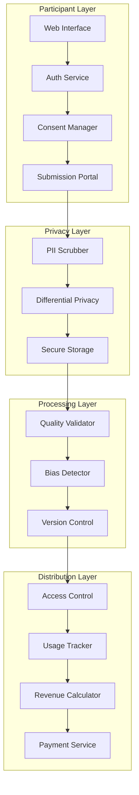

# Secure Technical Architecture for Ethical AI Competitions
## Engineering Solutions to Prevent Exploitation

*Created: July 10, 2025*  
*Version: 2.0 - Addressing identified vulnerabilities*

---

## System Architecture Overview



## Core Components

### 1. Privacy-Preserving Data Pipeline

```python
class PrivacyPipeline:
    """Implements multi-stage privacy protection"""
    
    def __init__(self):
        self.pii_patterns = self._load_pii_patterns()
        self.dp_epsilon = 1.0  # Differential privacy parameter
        
    async def process_submission(self, data: dict) -> dict:
        # Stage 1: PII Detection and Redaction
        cleaned = await self._scrub_pii(data)
        
        # Stage 2: Metadata anonymization
        anonymized = self._anonymize_metadata(cleaned)
        
        # Stage 3: Differential privacy noise
        private = self._add_dp_noise(anonymized)
        
        # Stage 4: Temporal generalization
        temporal = self._generalize_timestamps(private)
        
        return temporal
    
    def _scrub_pii(self, data: dict) -> dict:
        """Remove personally identifiable information"""
        # Implement using spaCy NER + regex patterns
        # Redact: names, emails, phone numbers, addresses
        # Preserve: technical content, attack patterns
        pass
```

### 2. Fair Attribution System

```yaml
attribution_schema:
  contribution:
    id: uuid
    participant_id: hashed_identifier
    timestamp: generalized_date
    technique_hash: sha256
    novelty_score: float
    
  usage_tracking:
    contribution_ref: uuid
    usage_type: [academic|commercial|training]
    usage_timestamp: date
    revenue_generated: decimal
    attribution_provided: boolean
    
  payment_calculation:
    base_rate: $0.10 per usage
    novelty_multiplier: 1.0-5.0x
    impact_bonus: $10-1000
    payment_frequency: monthly
```

### 3. Quality Validation Pipeline

```python
class QualityValidator:
    """Multi-dimensional quality assessment"""
    
    def validate(self, submission: dict) -> QualityScore:
        scores = {
            'novelty': self._assess_novelty(submission),
            'effectiveness': self._test_effectiveness(submission),
            'robustness': self._check_robustness(submission),
            'safety': self._verify_safety(submission),
            'bias': self._detect_bias(submission)
        }
        
        # Weighted scoring instead of binary pass/fail
        return QualityScore(
            scores=scores,
            weights=self.quality_weights,
            feedback=self._generate_feedback(scores)
        )
    
    def _assess_novelty(self, submission: dict) -> float:
        """Compare against existing technique database"""
        # Use embedding similarity to find related techniques
        # Higher distance = more novel
        pass
```

### 4. Secure Storage Architecture

```sql
-- Separation of concerns with multiple databases

-- Public dataset (post-processing)
CREATE TABLE public_contributions (
    id UUID PRIMARY KEY,
    technique_category VARCHAR(50),
    generalized_timestamp DATE,
    quality_scores JSONB,
    -- No PII, no exact timestamps, no direct attribution
);

-- Private attribution ledger (encrypted)
CREATE TABLE attribution_ledger (
    contribution_id UUID REFERENCES public_contributions(id),
    participant_hash VARCHAR(64),  -- One-way hash
    submission_time TIMESTAMP,
    encryption_key_id UUID,
    -- Encrypted with participant's key
);

-- Usage tracking (immutable)
CREATE TABLE usage_log (
    id SERIAL PRIMARY KEY,
    contribution_id UUID,
    usage_type VARCHAR(20),
    usage_context TEXT,
    revenue_impact DECIMAL,
    created_at TIMESTAMP DEFAULT NOW(),
    -- Append-only for audit trail
);
```

### 5. Anti-Exploitation Mechanisms

```python
class ExploitationPrevention:
    """Prevent various forms of participant exploitation"""
    
    def __init__(self):
        self.rate_limiter = RateLimiter(max_hours_per_week=40)
        self.burnout_detector = BurnoutDetector()
        self.value_tracker = ValueExtractor()
    
    async def check_participation(self, participant_id: str) -> bool:
        # Prevent excessive participation
        if await self.rate_limiter.exceeds_limit(participant_id):
            return False
            
        # Detect burnout patterns
        if await self.burnout_detector.shows_risk(participant_id):
            await self._offer_support(participant_id)
            return False
            
        return True
    
    async def calculate_compensation(self, contribution: dict) -> Decimal:
        # Ensure fair value distribution
        base_value = await self.value_tracker.estimate_worth(contribution)
        
        # Minimum compensation guarantee
        return max(base_value, Decimal('25.00'))  # $25 minimum
```

### 6. Bias Detection and Mitigation

```python
class BiasAuditor:
    """Continuous bias monitoring and correction"""
    
    def audit_dataset(self) -> BiasReport:
        metrics = {
            'language_distribution': self._analyze_languages(),
            'technique_diversity': self._measure_technique_variety(),
            'participant_demographics': self._assess_representation(),
            'success_rate_parity': self._check_fairness(),
        }
        
        recommendations = self._generate_corrections(metrics)
        
        return BiasReport(
            metrics=metrics,
            recommendations=recommendations,
            timestamp=datetime.now()
        )
    
    def _reweight_dataset(self, bias_report: BiasReport):
        """Adjust sampling weights to correct biases"""
        # Implement importance reweighting
        # Boost underrepresented groups
        # Reduce overrepresented patterns
        pass
```

### 7. Decentralized Governance Integration

```javascript
// Smart contract for transparent governance
contract CompetitionGovernance {
    struct Proposal {
        string description;
        uint256 forVotes;
        uint256 againstVotes;
        mapping(address => bool) hasVoted;
    }
    
    mapping(address => uint256) public participantShares;
    mapping(uint256 => Proposal) public proposals;
    
    function proposeChange(string memory description) public {
        require(participantShares[msg.sender] > 0, "Must be participant");
        // Create proposal for community vote
    }
    
    function distributeRevenue() public {
        // Automated fair distribution based on contributions
        // Transparent on-chain record
    }
}
```

## Security Hardening Checklist

### Data Protection
- [ ] End-to-end encryption for submissions
- [ ] Zero-knowledge proofs for attribution
- [ ] Homomorphic encryption for analysis
- [ ] Secure multi-party computation for evaluation
- [ ] Regular penetration testing

### Access Control
- [ ] Role-based permissions (principle of least privilege)
- [ ] Time-boxed data access tokens
- [ ] Audit logs for all data access
- [ ] Participant-controlled visibility settings
- [ ] Right to deletion implementation

### Infrastructure Security
- [ ] Container isolation for processing
- [ ] Network segmentation
- [ ] Regular security updates
- [ ] Intrusion detection systems
- [ ] Incident response plan

## Monitoring and Alerts

```yaml
monitoring_metrics:
  participant_welfare:
    - participation_hours_per_week
    - submission_frequency
    - quality_score_trends
    - compensation_per_hour
    
  system_health:
    - pii_detection_rate
    - processing_latency
    - storage_encryption_status
    - api_rate_limits
    
  fairness_indicators:
    - demographic_representation
    - language_diversity
    - technique_variety
    - success_rate_parity
    
alert_thresholds:
  burnout_risk: participation_hours > 40
  low_compensation: hourly_rate < $25
  pii_leak: detection_confidence > 0.8
  bias_detection: disparity_ratio > 1.5
```

## Implementation Timeline

### Phase 1: Core Privacy (Months 1-2)
- PII scrubbing pipeline
- Differential privacy implementation
- Secure storage setup

### Phase 2: Fair Attribution (Months 3-4)
- Attribution ledger
- Usage tracking system
- Revenue calculation engine

### Phase 3: Quality & Bias (Months 5-6)
- Multi-dimensional scoring
- Bias detection algorithms
- Continuous auditing

### Phase 4: Governance (Months 7-8)
- Smart contract deployment
- Voting mechanisms
- Revenue distribution automation

---

This architecture prioritizes participant protection while enabling valuable security research. All components are designed to prevent the exploitation patterns identified in existing platforms.